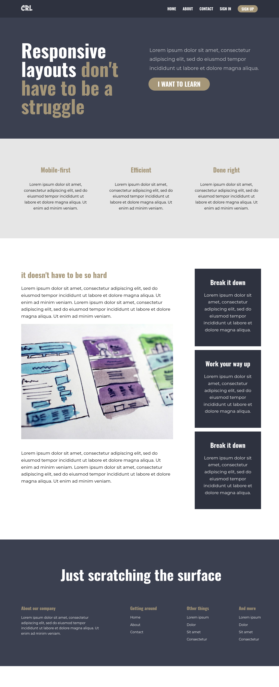

# Conquering Responsive Layout

This is a solution to the [Designing Conquering Responsive Layout challenge by Kevin Powell](https://courses.kevinpowell.co/conquering-responsive-layouts). it's an interesting challenge for CSS learners. This challenge has covered a lot of knowledge to know as a front-end developer. I will recommend this course to newbie front-end developers. And Yes It's free.

## Table of contents

- [Overview](#overview)
  - [The challenge](#the-challenge)
  - [Screenshot](#screenshot)
  - [Links](#links)
- [My process](#my-process)
  - [Built with](#built-with)
  - [Continued development](#continued-development)
- [Author](#author)

## Overview

### The challenge

Users should be able to:

- View the optimal layout for the component depending on their device's screen size

### Screenshot

### Links

- Live Site URL: [Conquering Responsive Layout](https://igmominkhan.github.io/Conquering-Responsive-Design/)
- GitHub code : [Conquering Responsive Layout](https://github.com/IgMominKhan/Conquering-Responsive-Design)

## My process

### Built with

- using CSS preprocessor Sass
- CSS BEM naming convention
- Semantic HTML5 markup
- CSS custom properties
- Flexbox
- Mobile-first workflow

## Author

- Github - [@Ig Momin Khan](https://github.com/IgMominKhan)
- Frontend Mentor - [@Ig Momin Khan](https://www.frontendmentor.io/profile/IgMominKhan)
- Twitter - [@Ig Momin Khan](https://twitter.com/Ig_Momin_Khan)
- Facebook - [@Ig Momin Khan](https://www.facebook.com/profile.php?id=100028163183392)
